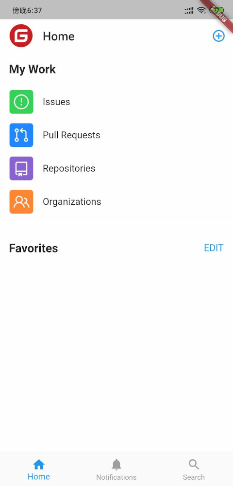

# flutter_gitee

flutter实现的gitee客户端,模仿github客户端ui

# TODO
* home页面 90%
* favorites页面 100%
* 详情页面 70%
* Browser code页面 90%
* login页面 100%
* 个人信息页面 100%
* 搜索页面 100%
* 动态页面 100%
* issues页面 0%
* pr页面 0%