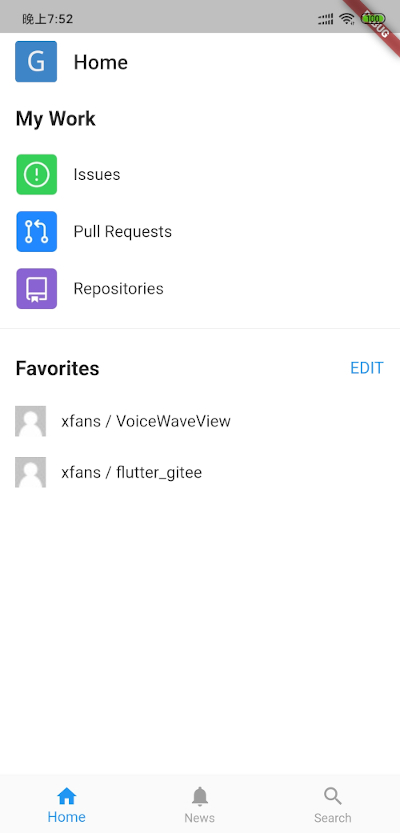

# flutter_gitee

flutter实现的gitee客户端,模仿github客户端ui

# TODO
* home页面 100%
* favorites页面 100%
* 详情页面 100% (暂时不打开md阅读功能,存在问题)
* Browser code页面 100% (目前仅支持纯文本)
* login页面 100%
* 个人信息页面 100%
* 搜索页面 100%
* 动态页面 100%
* 设置页面 0%
* issues页面 0%
* pr页面 0%
